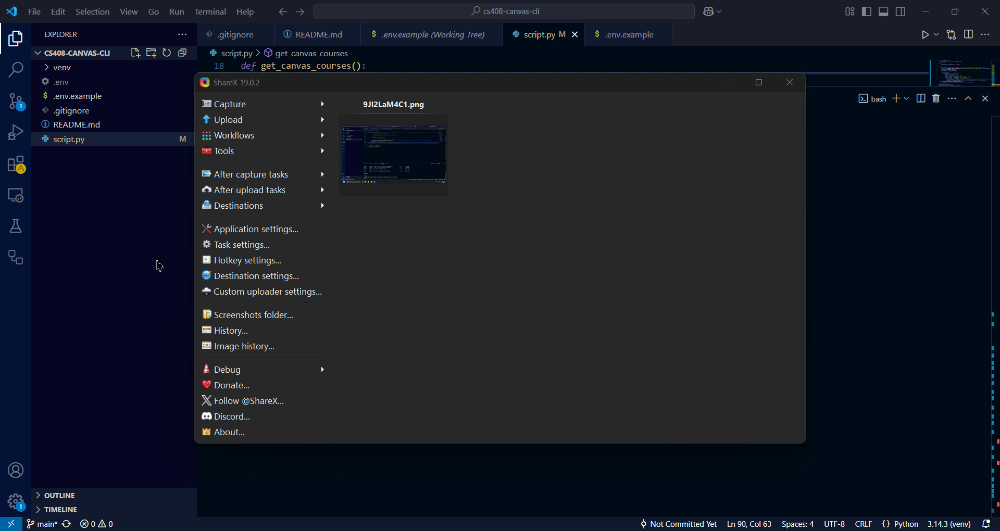

# CS408 Canvas CLI Project

This is a lab for my BSU CS408 class that utilizes Instructure Canvas's api tokens to access user grades. Users have the option to choose a specific class (with a class id) to view, or just view all class grades.

## Setup Instructions

In the project directory, create a '.env' file that contains a specification for your
CANVAS_API_TOKEN, see '.env.example' for formatting.

In a bash terminal, navigate to directory.

Set up the python environment:

`python -m venv venv`

Then either
`.\venv\Scripts\activate` (windows) or
`source venv/bin/activate` (linux/mac)

Make sure that your venv is activated, (venv) should appear in terminal prompt.
If you are using vscode and (venv) doesn't appear, kill and restart the terminal. (I had issues with VSCode needing to change the Python Interpreter in the IDE itself.)

Install necessary python libraries:

`pip install requests python-dotenv`

Then, to run program, use:

`python script.py`

## Example Uses

Using `python script.py` to run the program, when prompted to enter a class id, simply press enter to continue without entering a specific class, the program will then display all classes that the program is able to pull using API calls that have current grades that can be displayed, along with score percentage and class id. If bad input is provided for class id, program will automatically assume user is trying to display all classes.

Using `python script.py` to run the program, enter in a specific class id number and the program will show you the specific class with grade information if the class/info is able to be found.

## API Endpoints Used

This program uses two different Canvas api endpoints.

`/api/v1/courses`- Gets all courses from the user token, gets the id and name of each course.

`/api/v1/courses/:id/enrollments` - Gets the enrollments in a specific course, specified by an id that the first api endpoint got. Goes through the enrollments until it finds an object that contains a valid current_grade and current_score in the grade object gotten from each enrollment.

## Reflection

Ultimately, I thought that this was a pretty cool project. I don't really have too much experience with using APIs and API keys, I think the only class I had that I remember doing this in was CS208. Since I wasn't very familiar with this, it took me a little bit to figure out what exactly was going on with the API retrievals in python. I thought that the API TOKEN key system was pretty cool, and ultimately I found that in an API call for the canvas enrollments, the person that your token was associated with would have all the grade info, while other people didn't have grade info, which was interesting to use.

I think that projects like these where I include information in my README for setting up the project and using it are very useful for keeping my computer science skills in check. Also, it was cool to record a gif of myself using the program and uploading it to github. Ultimately, I had some fun with this assignment and thought it was pretty cool.

In my code, I used pagination for going through the canvas courses API calls. However, I did not use pagination for going through the enrollment api calls. The reason for this was that I was trying to implement a system for using pagination for the enrollment api calls, however, every single thing I tried seemed to make the program run extremely slow, to the point where it wasn't finishing in under a minute, which is really bad. However, I wanted to use that 2nd API call for the enrollment API in order to get the grade information, so I used ?per_page=200 also just to be extra sure that the program would find the enrollment information for the user. The enrollment information would return each person in a class so I think 200 is probably an okay number, however if I have more time for this project I will probably find a better way to handle this.

